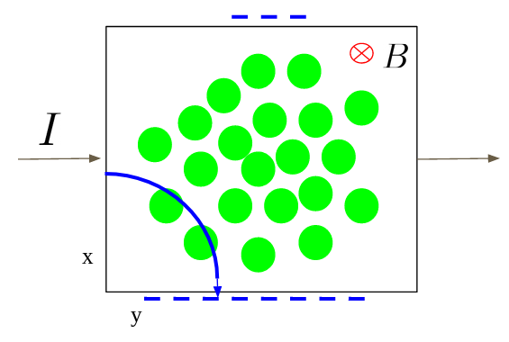
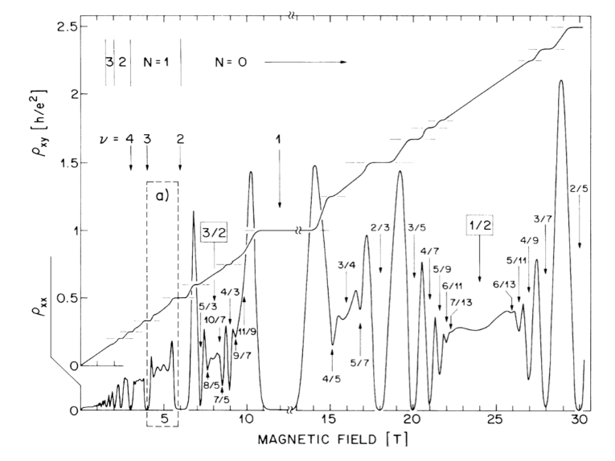
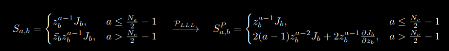
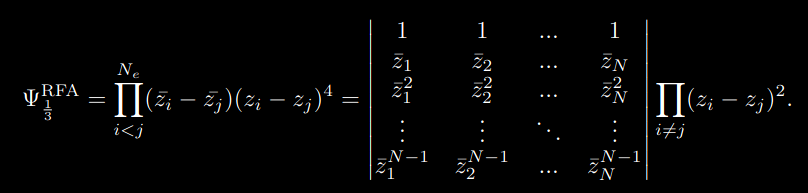

# Excitation Properties in Fractional Quantum Hall Systems

Here, I present the results of my Master's degree thesis research project.  The project investigated the properties of Fractional Quantum Hall States by using the Berry phase.  This allowed us to find the fractional charge and anyonic statistics of FQH excitations.  Using Composite Fermion theory, we showed the density displacement caused by the interaction of two excitations.  This was already seen in parallel flux attachment, and this project showed a different kind of displacement generated by Reverse Flux Attachment states.  The wavefunction was sampled using a Metropolis-Hastings Monte Carlo algorithm which was built by me from scratch.

[Link to Full Thesis Presentation](https://youtu.be/_2F7ueCfdWU)

## Hall System

  

The Hall system begins with electrons flowing across a finite, two dimensional surface generating a current, I, as seen in the figure above.  A magnetic field that points perpendicular to the surface is turned on, causing the electrons to experience a Lorentz force given by $\vec{F} = -e \vec{v} \times \vec{B}$.  The Lorentz force causes the path of an electron to curve downwards and stop at the lower edge of the surface.  As electrons continue to flow, more and more build up on the lower edge creating a voltage difference across the top and bottom edges of the surface: the Hall voltage.  With a voltage and a constant current, the associated resistance can be found as well using V = IR.

  

For small magnetic fields, the transverse Hall resistivity, $\rho_{xy}$ , increases linearly with the magnetic field.  However, because of quantum effects, at larger magnetic fields, plateaus begin to appear in the resistivity at specific field strengths.  These values of the magnetic field correspond to precise integer or fractional fillings of Landau levels by the electrons in the system: the integer or fractional quantum Hall effect.

## Composite Fermion Wavefunction
In 1983, Robert Laughlin wrote down a wavefunction that describes the fractional quantum Hall state to remarkable precision given that it is not an exact solution.  It is given by

$$\Psi_{m}^{L} = \prod_{i < j}^{N_e} (z_i - z_j)^m \prod_{k}^{N_e} e^{-\vert z_k \vert^2 / 4l^2}, \quad \nu = \frac{1}{m},$$

where the filling of the system is $\nu$ and the location of the electrons is given by $z=x-iy$.  The issue with the wavefunction is that it only works for systems that have fillings which can be written as $1/m$ which misses a wide range of experimentally seen fractions.

In order to build the Composite Fermion wavefunction, we begin with a system of electrons in a smaller magnetic field, B* < B, which has an integer filling, $\nu^* = n$.  In order to get the full magnetic field, 2p pairs of flux lines are attached to each electron to create a composite fermion.  In this way, systems with a filling fraction of 

$$\nu = \frac{n}{2pn+1}, \quad B = B^* + 2p \rho \phi_0$$

can be built with a wavefunction given by

$$\Psi_{\nu=\frac{n}{2pn+1}}^{CF} = P_{LLL} \Phi_{\nu^*=n} \prod_{i < j} (z_i - z_j)^{2p}$$

When the starting integer is unity, the usual Laughlin wavefunction is returned.  For a variety of technical physics reasons, the operator $P_{LLL}$ is used to project the wavefunction down to the Lowest Landau Level.

### Reverse Flux Attachment
In the previously described composite fermion language, the flux is attached parallel to the existing smaller magnetic field.  To get a filling of $1/3$, there is an integer component of one to which two flux lines are added: 1 + 2 = 3.  However, after learning addition in elementary school, we learned about subtraction: 4 - 1 = 3.  By having four flux lines pointing in the opposite direction as the small magnetic field, the same 1/3 filling fraction can be returned in a slightly different manner.  The resulting reverse flux wavefunction is given by

$$\Psi_{\nu=\frac{1}{2p-1}}^{RFA} = P_{LLL} \prod_{i < j} (\bar{z}_i - \bar{z}_j) (z_i - z_j)^{2p} \prod e^{-\vert z_k \vert^2/4l^2}$$

## Monte Carlo Simulation

The algorithm used in this project to sample the fractional quantum Hall wavefunction is the Metropolis-Hastings Monte Carlo method.  The code was built using the Julia language from scratch.  The pseudo-code for the algorithm is below.

#### (1) Start with particle configuration,

#### (2) For each particle;

(2a) Calculate probability of initial configuration, $P_{\textrm{initial}}$

(2b) Propose a random move with maximum step size $d_{max}$,

(2c) Calculate probability of new configuration, $P_{\textrm{proposed}}$

(2d) Get a random number $u \in [0,1]$

(2e) Calculate ratio $\alpha = P_{\textrm{proposed}}/P_{\textrm{initial}}$

(2f) If $\alpha \geq u$, accept new configuration

(2g) If $\alpha < u$, reject move and maintain initial configuration  

#### (3) Continue for $n_{\textrm{max}}$ sample steps.

The Metropolis-Hastings method is used because having the ratio, $\alpha$, be compared to a random number allows for moves that generate less likely configurations.  This prevents the system from getting stuck in local maximum regions.

### Lowest Landau Level Projection
In order to calculate the probability from a given wavefunction, the Slater matrix must be built and projected down to the LLL before the determinant can be taken.  Each element of the Slater matrix is composed of three parts: the integer filling orbital wavefunction, the Jastrow factor, and the excitation component.  Not every wavefunction has an excitation component so the last part is sometimes left out.  The Jastrow factor is the attachment of the $2p$ flux lines to each electron.  For particle $u$, the Jastrow factor and its derivative are 

$$
J_u = \prod_{i > u}^{N_e} (z_u - z_i)^{2p}, \quad \frac{\partial}{\partial z_u} J_{u} = 2 \sum_{j > u} (z_u - z_j)^{2p-1} \prod_{i > u, i \neq j} (z_u - z_i)^{2p},
$$

Each column corresponds to a given particle, so the whole column is multiplied by the corresponding Jastrow factor.  In this project, the only integer fillings used were $n = 1$ and $2$.  Therefore, any orbital wavefunction can be written as $\bar{z}^l z^m$, where $l = n - 1$.  The value $m$ corresponds to the angular momentum orbital and is used to determine which row of the Slater matrix the factor should be on.  The wavefunction for the excitation, either quasi-hole or quasi-particle, is dependent only on which particle it is interacting with.  Thus, to include a quasi-particle each element of the last row of the Slater matrix is replaced by the quasi-particle wavefunction as a function of the particle that corresponds to that element.  The last row is replaced because quasi-particles always sit in the next highest Landau level.  For a quasi-hole the same procedure is done but with the first row of the Slater matrix.

The LLL projection operator sends all $\bar{z}$'s to derivatives, and within our description $\bar{z}$'s only occur either in $n = 2$ states or when there is a quasi-particle.  For an $n = 2$ state without any excitations, an element of the Slater matrix looks like

  

An exact calculation of the projected element numerically is possible just with knowledge of the particle configuration and the location of the element.  In this way, there is no issue with numerical precision apart from floating point limits of the machine.  When a quasi-particle is included, the same analytical procedure can be done where the only additional knowledge needed is where the quasi-particle is localized.  The full analytical calculation is even more messy than the $n = 2$ case and thus is not shown here.

### Reverse Flux Attachment
For reverse flux attachment, the procedure is significantly more complicated because there is a product of $N_e$ derivatives which all require chain rule.  The wavefunction for a filling of $\nu = 1/3$ without the Gaussian component is given by

  

A given element of the full Slater matrix whose determinant defines the wavefunction can be written as $S_{a,b} = \bar{z_{b}}^{a-1} J_{b}^{2}$, where $J_b$ is the same Jastrow factor as Equation \ref{eq:jastrow} for $p = 1$.  In order to get an exact value for each element, we need to be able to take a derivative of any order of the Jastrow factor.  To deal with the power of two, we separate the term into $J_{b}^{(1)}$ and $J_{b}^{(2)}$.  When taking derivatives of two functions multiplied by each other, the coefficients in front of each term come from Pascal's triangle where the row corresponds to the order of the derivative.  Because the two terms are equal, the ending coefficients can be found by folding Pascal's triangle along the vertical axis and summing the overlapping values.

The Jastrow factor is a product where each element of the product contains a reference to one of the other particles in the system.  When a derivative is taken with respect to the base particle the Jastrow factor is made for, there is a chain rule operation across each term from the other particles in the product.  For example, if the base particle is $z_1$ and there are 4 particles in the system, the other particles in the product are $[2,3,4]$.  The terms in the Jastrow factor are order-1 polynomials so when the first derivative is taken, the chosen element goes to one.  That element is removed and we are left with the elements from particles $[2,3]+[2,4]+[3,4]$.  The procedure of taking a derivative on a state of 4 particles, meaning there are 3 particles to work on, uses combinatorics to see how many ways 2 particles can be grouped given the starting 3 possibilities.  This can then be generalized such that for a system of $N_e$ particles, the $f^{th}$ order derivative finds how many ways groups of $(N_e - f - 1)$ particles be put together.  Therefore, to maintain an exact expression for the derivative, we recursively calculate the possible groups of accepted particles along which how many ways the group can be written and use this to calculate the derivative of the Jastrow factor.

Computationally, it is very expensive to calculate these groups, so we do not want to recalculate them every time we calculate the wavefunction.  This process would be repeated many times during the Monte Carlo simulation, so instead a matrix is calculated which finds all the groups and coefficients for every derivative order for a given number of particles.  This matrix can then be called externally which is much faster than running the same recursive algorithm at every step.
