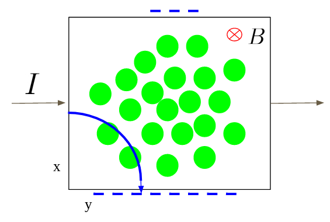
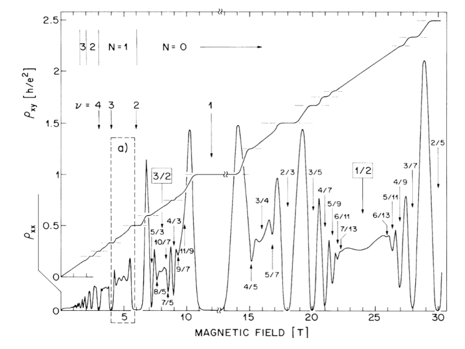

# Excitation Properties in Fractional Quantum Hall Systems

Here, I present the results of my Master's degree thesis research project.  The project investigated the properties of Fractional Quantum Hall States by using the Berry phase.  This allowed us to find the fractional charge and anyonic statistics of FQH excitations.  Using Composite Fermion theory, we showed the density displacement caused by the interaction of two excitations.  This was already seen in parallel flux attachment, and this project showed a different kind of displacement generated by Reverse Flux Attachment states.  The wavefunction was sampled using a Metropolis-Hastings Monte Carlo algorithm which was built by me from scratch.

[Link to Full Thesis Presentation](https://youtu.be/_2F7ueCfdWU)

## Hall System

  

The Hall system begins with electrons flowing across a finite, two dimensional surface generating a current, I, as seen in the figure above.  A magnetic field that points perpendicular to the surface is turned on, causing the electrons to experience a Lorentz force given by $\vec{F} = -e \vec{v} \times \vec{B}$.  The Lorentz force causes the path of an electron to curve downwards and stop at the lower edge of the surface.  As electrons continue to flow, more and more build up on the lower edge creating a voltage difference across the top and bottom edges of the surface: the Hall voltage.  With a voltage and a constant current, the associated resistance can be found as well using V = IR.

  

For small magnetic fields, the transverse Hall resistivity, $\rho_{xy}$ , increases linearly with the magnetic field.  However, because of quantum effects, at larger magnetic fields, plateaus begin to appear in the resistivity at specific field strengths.  These values of the magnetic field correspond to precise integer or fractional fillings of Landau levels by the electrons in the system: the integer or fractional quantum Hall effect.

## Composite Fermion Wavefunction
In 1983, Robert Laughlin wrote down a wavefunction that describes the fractional quantum Hall state to remarkable precision given that it is not an exact solution.  It is given by

$$\Psi_{m}^{L} = \prod_{i < j}^{N_e} (z_i - z_j)^m \prod_{k}^{N_e} e^{-\vert z_k \vert^2 / 4l^2}, \quad \nu = \frac{1}{m},$$

where the filling of the system is $\nu$ and the location of the electrons is given by $z=x-iy$.  The issue with the wavefunction is that it only works for systems that have fillings which can be written as $1/m$ which misses a wide range of experimentally seen fractions.

In order to build the Composite Fermion wavefunction, we begin with a system of electrons in a smaller magnetic field, B* < B, which has an integer filling, $\nu^* = n$.  In order to get the full magnetic field, 2p pairs of flux lines are attached to each electron to create a composite fermion.  In this way, systems with a filling fraction of 

$$\nu = \frac{n}{2pn+1}, \quad B = B^* + 2p \rho \phi_0$$

can be built with a wavefunction given by

$$\Psi_{\nu=\frac{n}{2pn+1}}^{CF} = P_{LLL} \Phi_{\nu^*=n} \prod_{i < j} (z_i - z_j)^{2p}$$

When the starting integer is unity, the usual Laughlin wavefunction is returned.  For a variety of technical physics reasons, the operator $P_{LLL}$ is used to project the wavefunction down to the Lowest Landau Level.

### Reverse Flux Attachment
In the previously described composite fermion language, the flux is attached parallel to the existing smaller magnetic field.  To get a filling of $1/3$, there is an integer component of one to which two flux lines are added: 1 + 2 = 3.  However, after learning addition in elementary school, we learned about subtraction: 4 - 1 = 3.  By having four flux lines pointing in the opposite direction as the small magnetic field, the same 1/3 filling fraction can be returned in a slightly different manner.  The resulting reverse flux wavefunction is given by

$$\Psi_{\nu=\frac{1}{2p-1}}^{RFA} = P_{LLL} \prod_{i < j} (\bar{z}_i - \bar{z}_j) (z_i - z_j)^{2p} \prod e^{-\vert z_k \vert^2/4l^2}$$

## Monte Carlo Simulation

